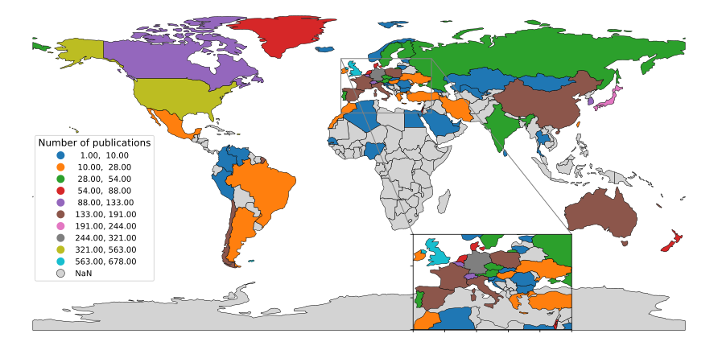

# Introduction

<p>
        Plotting geographical maps turned out to be more difficult than I thought. It always start with data structure issues. 
        In the case of geographic maps, political changes influence our ability to visualize geographic data.
        For instance, changes in country names, recognition of territories as independent, and of course designating the borders of disputed teritories.
        Also, the use of codes for distinguishing countries can be tricky. 
        For example, the changes and reundancies in country codes (iso_alpha2 and iso_alpha_3) and the name variations of countries.
        First we start by creating simple choropleth maps in R and python.
        Later, we will follow with ideas on how to achieve simple disambiguation of the various names and country codes.
        For now some definitions . . . 
</p>

<P>
        Plotly definition:
        <em>
                A Choropleth is a symbol or marked and bounded area on a map denoting the distribution of some property.
        </em>
</P>
            

let's start!

# Choropleth mapping in R
Here are the libraries we will need to use.
```
library(RPostgres) # To interact with postgresql
library(glue) # Add python-style f-strings
library(plotly) # To create interactive charts
library(sf)#for generating the maps
library(svglite) #to save svg images using ggsave function
library(htmlwidgets)#used to create interactive plots
library(tidyverse)#for data manipulations used to pivot variables longer
library(rlist) # Add the list type
library(sommer) # when using the jet colours Jaco recommended
library(readxl)
```
## Connect to postgreSQL and retrieve data
First let us obtain and have a look at our data. We will be using a bibliometric data example with 70 countries.
I will be getting my data through a local database.

```
# Script settings
credentials <- readxl::read_xlsx("C:/Users/folder/my_credentials.xlsx")
crest_dbname =  credentials$crest_dbname[c(1)]
crest_host = credentials$crest_host[c(1)] 
crest_port = 5432
crest_user = credentials$crest_user[c(1)] 
crest_password = credentials$crest_password[c(1)]

#first establish connection to database
drv <- RPostgres::Postgres()
print("Connecting to Database…")
connec <- dbConnect(drv, 
                    dbname = crest_dbname,
                    host = crest_host, 
                    port = crest_port,
                    user = crest_user, 
                    password = crest_password)
print("Database Connected!")

table = 'ctry_bins'
schema = 'my_schema'

# Fetch required data
query <- dbSendQuery(connec, glue('select * from "{schema}"."{table}";'))
country_map <- dbFetch(query)
```
|region|total_count|tw1|tw2|
| ------------- | ------------- | ------------- |------------- |
Algeria|1|1|NA|
Argentina|23|2|12|
Australia|150|33|71|
Austria|39|7|28|
Belgium|123|36|63|
Brazil|28|4|14|
Bulgaria|7|2|2|
Canada|110|7|68|
Chile|181|23|107|
Colombia|3|NA|2|
Cook Islands|1|NA|1|
Croatia|5|2|2|
Czech Republic|49|5|21|
Denmark|85|5|52|
Egypt|4|NA|4|
England|435|127|206|
Estonia|1|NA|1|
Finland|35|2|17|
France|156|35|80|
Georgia|3|NA|1|
Germany|321|38|201|
Greece|22|5|9|
Hungary|28|2|15|
Iceland|3|NA|2|
India|44|5|21|
Iran|14|NA|11|
Ireland|20|2|11|
Israel|71|1|41|
Italy|143|9|96|
Japan|244|64|131|
Kazakhstan|5|NA|3|
Lithuania|3|NA|NA|
Macedonia|1|1|NA|
Malta|1|NA|NA|
Mexico|21|NA|18|
Mongolia|1|NA|1|
Morocco|21|1|12|
Netherlands|80|15|34|
New Zealand|88|3|64|
Nigeria|2|NA|1|
North Ireland|99|44|41|
Norway|3|1|NA|
Peoples R China|150|3|94|
Peru|5|NA|3|
Poland|160|20|97|
Portugal|38|3|22|
Qatar|10|NA|10|
Romania|4|1|NA|
Russia|51|3|21|
Saudi Arabia|5|NA|5|
Scotland|123|48|59|
Senegal|1|NA|NA|
Serbia|3|1|2|
Slovakia|6|1|NA|
Slovenia|3|NA|2|
South Korea|133|3|97|
Spain|191|42|83|
Sri Lanka|1|NA|NA|
Sweden|54|5|26|
Switzerland|118|29|69|
Taiwan|24|5|15|
Thailand|3|NA|2|
Turkey|13|1|7|
U Arab Emirates|10|NA|7|
Ukraine|15|3|5|
USA|563|106|299|
Uzbekistan|2|NA|1|
Vatican|6|NA|4|
Venezuela|2|NA|1|
Wales|21|1|11|

## Inspect and mutate the data
```
country_map$region <- as.character(country_map$region)
country_map$total_count <- as.numeric(country_map$total_count)
country_map$tw1 <- as.numeric(country_map$tw1)
country_map$tw2 <- as.numeric(country_map$tw2)
mapdata = map_data("world") #get the latitutes and longitudes
mapdata = left_join(mapdata, country_map, by = "region") #join the two sets
```

## Plot the chloropleth using ggplot2
```
my_breaks <-
  round(seq(from = ceiling(min(mapdata$total_count, na.rm = TRUE)),
      to = ceiling(max(mapdata$total_count, na.rm = TRUE)),
      length.out = 10), digits = 0) 

map_data_continuous = ggplot(mapdata, aes(x = long, y = lat, group = group)) +
  geom_polygon(
    aes(fill = total_count),
    colour = "black",
    alpha = 0.9,
    linewidth = 0.1
  ) +
  theme(
    legend.key.size = unit(1, 'cm'),# change legend key size
    legend.key.width = unit(0.7, 'cm'),
    legend.key.height = unit(0.7, 'cm'),
    legend.title = element_text(size = 9),
    legend.position = c(0.1, 0.45),
    legend.text = element_text(size = 8),
    legend.direction = "vertical",
    axis.text.x = element_blank(),
    axis.text.y = element_blank(),
    axis.ticks = element_blank(),
    axis.title.x = element_blank(),
    axis.title.y = element_blank(),
    rect = element_blank()
  ) + scale_fill_gradientn(
    colours = jet.colors(length(my_breaks)),
    na.value = "white",
    name = "Number of publications",
    breaks = my_breaks,
    guide = "legend"
  )
# create,save, and open a static plot
ggsave(
  "choropleth_example_r.svg",
  plot = map_data_continuous,
  width = 12.5,
  height = 6) 
browseURL("choropleth_example_r.svg")
```

  <figcaption>Choropleth map generated using GGplot2.</figcaption>

# Convert, save, and open an interactive plot
active_plot = ggplotly(map_data_continuous, tooltip = "all")
saveWidget(active_plot, "choropleth_example_r.html")
browseURL("choropleth_example_r.html")

# Choropleth mapping in python

Here are the libraries we will need to use.
```
# Import necessary libraries
import psycopg # to connect to postgresql
import matplotlib.pyplot as plt # our plotig library
import plotly.express as px # to plot the interactive map
import pandas as pd # to manipulate data
import geopandas # to plot the static map
```
## Connect to postgreSQL and retrieve data
Here is the retrieval code example fro python. This will look very similar to the R code.

```
credentials = pd.read_excel("C:/Users/folder/my_credentials.xlsx")
crest_port = 5432
crest_dbname = credentials.crest_dbname[0]
crest_host = credentials.crest_host[0]
crest_user = credentials.crest_user[0]
crest_password = credentials.crest_password[0]
# connect to postgresql
connec = psycopg.connect(
    port=5432,
    host=crest_host,
    dbname=crest_dbname,
    user=crest_user,
    password=crest_password)
#Retrieve data tables
cursor = connec.cursor()
table1 = 'ctry_bins_maps'
schema1 = 'my_schema'
cursor.execute(f'SELECT * from {schema1}.{table1}')
# Fetch required data
biblio_data = cursor.fetchall()
#Closing the connection
connec.close()
```

## Inspect and mutate the data
Now we can have a look at the data. The data is the same as that used fro R above. We find a few variations in conventions so we match these so they can be plotted.

```
# mutate data and add column names
biblio_data = pd.DataFrame(biblio_data)
biblio_data.columns = ["country","total_count","tw1", "tw2"]
# CHANGE COUNTRY NAMES TO MATCH GEOPANDA LIST
biblio_data['country'] = biblio_data['country'].replace(['USA', 'UK', 'Czech Republic'],
                                                    ['United States of America', 'United Kingdom', 'Czechia'])
print(biblio_data) # inspect the data
```

## Plot the chloropleth using geopandas
```
world = geopandas.read_file(geopandas.datasets.get_path('naturalearth_lowres'))
world.columns=['pop_est', 'continent2', 'country', 'Country Code', 'gdp_md_est', 'geometry']
mapdata=pd.merge(world,biblio_data, how = "outer", on='country') # Merge with our data

fig, ax = plt.subplots(nrows=1, ncols=1, figsize=(16,10))
ax.axis('off')

mapplot = mapdata.plot(column='total_count',
                       scheme='naturalbreaks',
                       k=10,
                       ax=ax,
                       legend=True,
                       edgecolor='black',
                       linewidth=0.5,
                       missing_kwds={"color": "lightgrey"},
                       legend_kwds={"title": 'Number of publications',
                                    'bbox_to_anchor':(0.22, 0.62),
                                    'title_fontsize':12,
                                    'fontsize':10}
                       )
plt.savefig(fname = 'choropleth_example.svg',dpi = 600,
            bbox_inches="tight", pad_inches=0.0,
            transparent=True, format = "svg")
plt.show()
```

  <figcaption>Choropleth map generated using Geopandas.</figcaption>

## Interactive mapping with Plotly
```
# plot an interactive map using plotly
biblio_map = px.choropleth(biblio_data,
                           locationmode = 'country names',
                           locations="country",
                           scope="world",
                           hover_name="country",
                           color="total_count",
                           color_continuous_scale="Viridis")
biblio_map.show()
```

